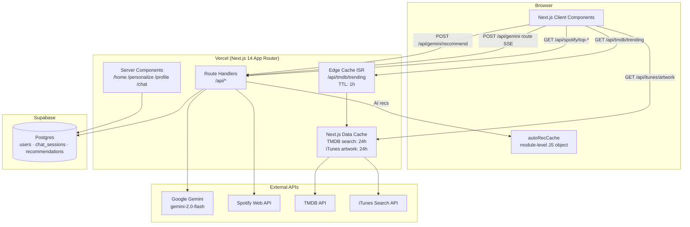
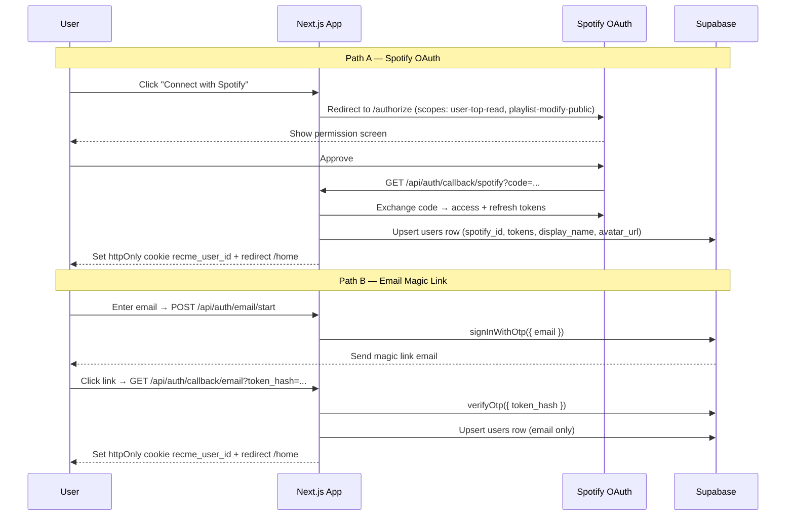
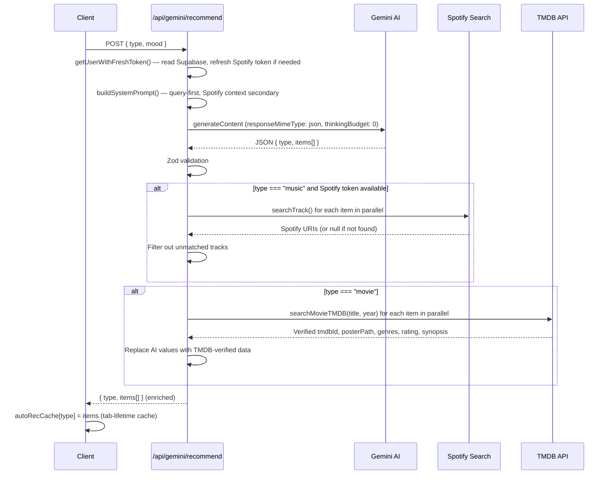
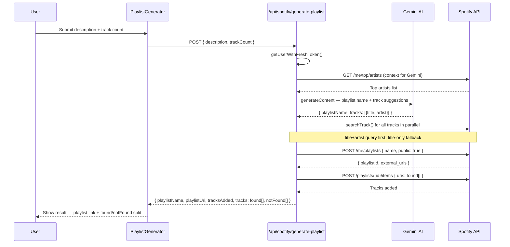
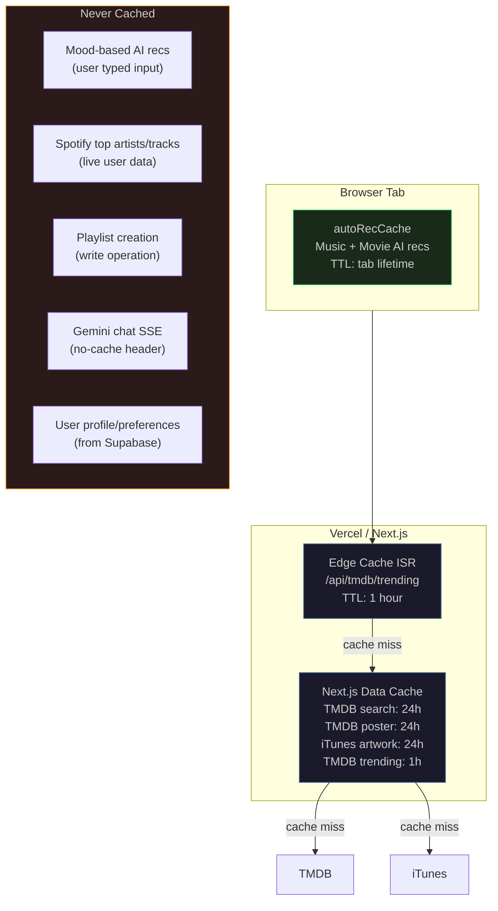

# 🔴 RecMe — Your taste. Amplified.

> AI-powered music and movie recommendations, personalised to your Spotify listening history.

[](https://rec-me-mu.vercel.app)
[](https://nextjs.org)
[](https://typescriptlang.org)
[](https://ai.google.dev)
[](https://supabase.com)

---

## What is RecMe?

RecMe is a dark, editorial-grade web app that uses your Spotify listening history as input and Google Gemini AI as its engine to recommend music and movies that actually fit your taste.

Every recommendation comes with a human-readable reason explaining *why* it was picked for you — not just a ranked list.

### Core ideas

- **It knows you** — uses your real Spotify top artists, top tracks, and genre preferences, not generic popularity signals
- **It explains itself** — every rec includes a one-sentence reason tied to the specific query
- **It acts** — can push AI-generated playlists directly into your Spotify account
- **It looks great** — cinematic dark UI inspired by Letterboxd × Spotify × luxury editorial

---

## Features

| Feature | Details |
|---|---|
| 🎵 Music recommendations | AI picks based on mood input + Spotify listening history |
| 🎬 Movie recommendations | AI picks with TMDB-verified posters, ratings, and synopsis |
| 🎭 Mood search | Type any mood, vibe, or description — AI returns matched results |
| 🤖 Auto-recommendations | Personalised recs load automatically on home page, cached for tab session |
| 🎧 AI playlist creation | Describe a vibe → Gemini generates a tracklist → pushed to your Spotify |
| 💬 AI chat | Full conversational interface with streaming responses + session history |
| 🔖 Saved recs | Bookmark music and movies, view later in Profile |
| 📊 Top artists & tracks | View your Spotify top 20 artists and top 50 tracks |
| 🎛️ Genre preferences | Set music and movie genre preferences that inform all AI recommendations |
| 🌍 Trending | TMDB trending movies — edge-cached, updated hourly |
| 🔐 Dual auth | Spotify OAuth (full access) + email magic link (movie-only) |

---

## Tech stack

| Layer | Technology |
|---|---|
| Framework | Next.js 14 (App Router, TypeScript) |
| Styling | Tailwind CSS v3 + CSS variables + Framer Motion |
| Database | Supabase (Postgres + RLS) |
| Auth | Custom httpOnly cookie session over Supabase |
| AI Engine | Google Gemini `gemini-2.0-flash` via `@google/genai` |
| Music data | Spotify Web API |
| Movie data | TMDB API |
| Album art | iTunes Search API (server-side proxy) |
| Validation | Zod (all AI and external API responses) |
| Hosting | Vercel |

---

## Architecture

### System overview



---

### Auth flow



---

### AI recommendation flow



---

### AI playlist creation flow



---

### Caching layers



---

## Project structure

```
src/
├── app/
│   ├── layout.tsx              # Root layout — fonts, OG metadata, film-grain
│   ├── globals.css             # CSS variables, design tokens, film-grain keyframe
│   ├── page.tsx                # Redirects → /home
│   ├── home/page.tsx           # Universal landing (SSR auth detection)
│   ├── personalize/page.tsx    # AI playlist + Spotify top data (auth required)
│   ├── profile/page.tsx        # Preferences + saved recs (auth required)
│   ├── chat/page.tsx           # Full chat interface
│   ├── signin/page.tsx         # Spotify + email sign-in
│   └── api/
│       ├── auth/               # OAuth callbacks, email OTP, logout
│       ├── gemini/             # Recommendations + streaming chat
│       ├── spotify/            # Top artists/tracks, playlist creation
│       ├── tmdb/               # Trending + poster proxy
│       ├── itunes/             # Album art proxy (CORS workaround)
│       ├── recommendations/    # Saved recs CRUD (Supabase)
│       ├── chat/               # Chat session CRUD (Supabase)
│       └── profile/            # Genre preferences update
│
├── components/
│   ├── landing/LandingContent.tsx       # Home page body (client)
│   ├── dashboard/                       # MusicTab, MoviesTab, DashboardContent
│   ├── personalize/PersonalizeContent.tsx
│   ├── profile/ProfileClient.tsx
│   ├── chat/                            # ChatPageClient, ChatSidebar, StreamingChat
│   └── shared/                          # Navbar, RecommendationCard, MoodInput,
│                                        # TabSwitcher, PlaylistCreator, PlaylistGenerator
│
├── hooks/
│   ├── useRecommendations.ts   # Gemini recs + module-level autoRecCache
│   └── useChat.ts              # Chat session management
│
├── lib/
│   ├── gemini.ts               # Gemini client
│   ├── gemini/prompt.ts        # buildSystemPrompt(), buildChatSystemPrompt()
│   ├── spotify.ts              # All Spotify helpers (auth, data, playlists, search)
│   ├── tmdb.ts                 # TMDB search + trending
│   ├── env.ts                  # Typed lazy env accessor
│   └── auth/session.ts         # getUserWithFreshToken()
│
└── types/                      # Zod schemas + TypeScript types
    ├── recommendations.ts
    ├── spotify.ts
    ├── tmdb.ts
    └── db.ts
```

---

## Pages

### `/home` — Universal landing

```
Guest view                          Logged-in view
─────────────────────────           ─────────────────────────────
Hero: "Your taste. Amplified."      Time-aware greeting + username
CTAs: Spotify + Email sign-in       Auto-loaded AI music recs
                                    Auto-loaded AI movie recs
TMDB trending movies strip          TMDB trending movies strip
Curated music strip                 (personalised ranking by taste)
Sticky sign-in banner
```

### `/personalize` — Your Spotify data + AI playlists

- Describe a playlist vibe → AI generates tracklist → pushed to Spotify
- View your top 20 artists (with image + top genre)
- View your top 50 tracks (with album art + artist)

### `/profile` — Preferences + history

- Set music and movie genre preferences (used in all AI prompts)
- View and unsave bookmarked recommendations
- Connected accounts — Spotify connection status + reconnect

### `/chat` — Full AI conversation

- Streaming Gemini responses (SSE)
- Left sidebar: all past sessions, deletable
- Context-aware: AI knows your Spotify artists and genre preferences

---

## Local setup

> **Note:** Spotify OAuth does not work on localhost — the redirect URI is production-only. Use the live site to test auth.

```bash
git clone https://github.com/ramprasanth0/RecMe.git
cd RecMe
npm install
```

Create `.env.local`:

```bash
# Spotify
SPOTIFY_CLIENT_ID=
SPOTIFY_CLIENT_SECRET=
SPOTIFY_REDIRECT_URI=https://rec-me-mu.vercel.app/api/auth/callback/spotify

# TMDB
TMDB_API_KEY=

# Gemini
GEMINI_API_KEY=

# Supabase
NEXT_PUBLIC_SUPABASE_URL=https://gfdtuqlzvehrvtfexoeg.supabase.co
NEXT_PUBLIC_SUPABASE_ANON_KEY=
SUPABASE_SERVICE_ROLE_KEY=
```

```bash
npm run dev       # http://localhost:3000
npm run typecheck # must pass before any commit
npm run lint      # must pass before any commit
```

---

## Deployment

Deployed on Vercel. Every push to `main` triggers a production deployment.

### Required Supabase manual step

> **Authentication → URL Configuration → Redirect URLs**
> Add: `https://rec-me-mu.vercel.app/api/auth/callback/email`
>
> Email magic link auth fails in production without this.

---

## Database schema

```sql
-- Users
create table users (
  id uuid primary key default gen_random_uuid(),
  email text unique,
  spotify_id text unique,
  spotify_access_token text,
  spotify_refresh_token text,
  display_name text,
  avatar_url text,
  preferences jsonb default '{}',  -- { music_genres: [], movie_genres: [] }
  created_at timestamptz default now()
);

-- Chat sessions
create table chat_sessions (
  id uuid primary key default gen_random_uuid(),
  user_id uuid references users(id),
  type text check (type in ('music', 'movie')),
  messages jsonb default '[]',     -- [{ role, content, timestamp }]
  created_at timestamptz default now()
);

-- Saved recommendations
create table recommendations (
  id uuid primary key default gen_random_uuid(),
  user_id uuid references users(id),
  type text check (type in ('music', 'movie')),
  item_data jsonb,                 -- full MusicItem or MovieItem object
  saved_at timestamptz default now()
);
```

---

## Design system

| Token | Value | Use |
|---|---|---|
| `--background` | `#0A0A0A` | Page backgrounds |
| `--surface` | `#111111` | Cards, panels |
| `--music-accent` | `#1DB954` | Spotify green — music actions |
| `--movie-accent` | `#F5A623` | Warm amber — movie actions |
| `--foreground` | `#DDDDDD` | Primary text |
| `--muted-foreground` | `#888888` | Secondary text |

**Fonts:** Playfair Display (headings) · Inter (body) · JetBrains Mono (AI output)

**Motion:** Framer Motion — page entrance, staggered card reveals, tab cross-fade, logo animation

---

## More documentation

| File | Contents |
|---|---|
| `handoff/architecture.md` | Full stack, data flow, env vars reference |
| `handoff/auth-flow.md` | OAuth + OTP flows, cookie model, token refresh |
| `handoff/routes-and-api.md` | Every page and API route documented |
| `handoff/design-system.md` | Tokens, components, animation patterns |
| `handoff/key-decisions.md` | Firm decisions and what NOT to do |
| `project-architecture/caching.md` | All caching layers with TTLs and rationale |
| `diagrams/caching-architecture.md` | Mermaid diagrams for caching |
| `diagrams/ai-playlist-creation.md` | Mermaid diagrams for playlist flow |
| `BUG_REPORT.md` | 20 bugs resolved — root causes and fixes |

---

*Built with Next.js · Supabase · Google Gemini · Spotify API · TMDB · Deployed on Vercel*
