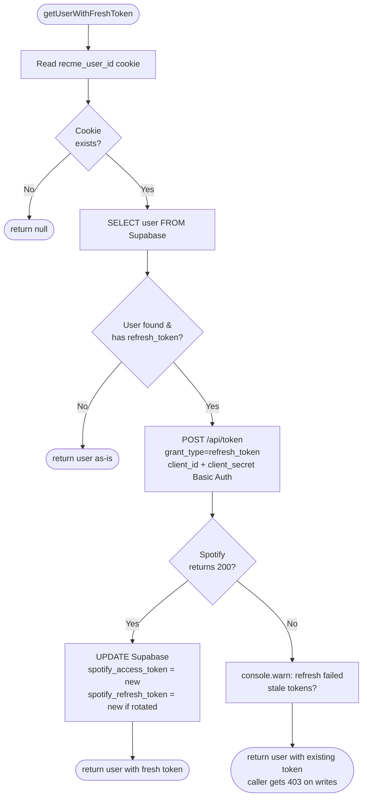
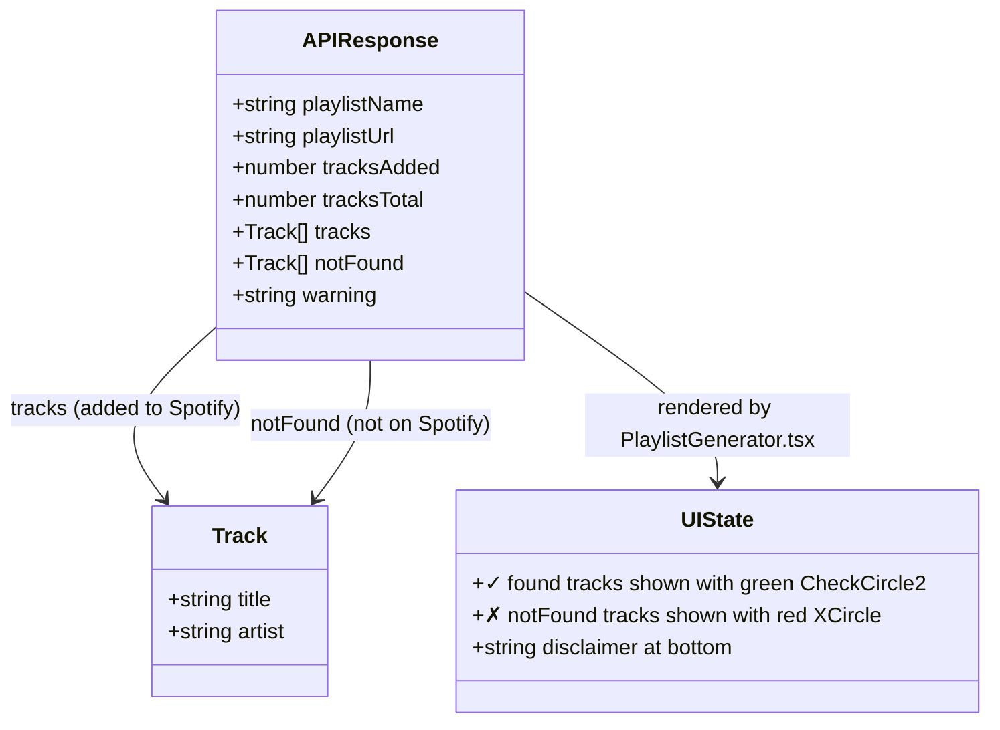

# AI Playlist Creation — Data Flow

## 1. End-to-End Sequence

```mermaid
sequenceDiagram
    actor U as User
    participant PG as PlaylistGenerator.tsx
    participant API as /api/spotify/generate-playlist
    participant Session as lib/auth/session
    participant DB as Supabase (users)
    participant SpotifyAccounts as Spotify Accounts API
    participant Spotify as Spotify Web API
    participant Gemini as Gemini API (gemini-2.0-flash)

    U->>PG: Submit prompt + trackCount (5–20)

    PG->>API: POST /api/spotify/generate-playlist\n{ prompt, trackCount }

    rect rgb(30, 40, 60)
        Note over API,DB: Step 1 — Auth & token refresh
        API->>Session: getUserWithFreshToken()
        Session->>DB: SELECT * FROM users\nWHERE id = cookie(recme_user_id)
        DB-->>Session: { spotify_access_token, spotify_refresh_token, ... }
        Session->>SpotifyAccounts: POST /api/token\n{ grant_type: refresh_token,\n  refresh_token,\n  client_id, client_secret (Basic Auth) }
        SpotifyAccounts-->>Session: { access_token, refresh_token? }
        Session->>DB: UPDATE users SET spotify_access_token = new_token
        Session-->>API: user with fresh access_token
    end

    rect rgb(30, 50, 40)
        Note over API,Spotify: Step 2 — Fetch user taste context (parallel)
        par
            API->>Spotify: GET /me/top/artists?limit=10
            Spotify-->>API: artists[{ name }]
        and
            API->>Spotify: GET /me/top/tracks?limit=10
            Spotify-->>API: tracks[{ name, artists[{ name }] }]
        end
        API->>API: Build userContext string\n"User's top artists: ...\nUser's top tracks: ..."
    end

    rect rgb(50, 30, 40)
        Note over API,Gemini: Step 3 — AI playlist generation
        API->>Gemini: generateContent(aiPrompt)\nmodel: gemini-2.0-flash\ntemperature: 0.8\nresponseMimeType: application/json\nthinkingBudget: 0
        Note right of API: Prompt contains:\n• user prompt\n• userContext (top artists/tracks)\n• trackCount\n• rules: exact Spotify names only\n• output schema: { playlistName, tracks[] }
        Gemini-->>API: { playlistName: "...",\n  tracks: [{ title, artist }, ...] }
        API->>API: Parse JSON\n(strip markdown fences, extract {})
    end

    rect rgb(30, 40, 60)
        Note over API,Spotify: Step 4 — Create empty playlist
        API->>Spotify: POST /me/playlists\n{ name: playlistName,\n  description: "Created by RecMe AI — prompt",\n  public: true }
        Spotify-->>API: { id: playlistId,\n  external_urls.spotify: url }
    end

    rect rgb(50, 40, 20)
        Note over API,Spotify: Step 5 — Resolve track URIs (all parallel via Promise.all)
        loop For each { title, artist } in tracks
            API->>Spotify: GET /v1/search?q=title+artist&type=track&limit=1
            Spotify-->>API: tracks.items[0].uri OR empty
            alt URI found
                API->>API: → found[] ✓
            else No result
                Note right of API: Fallback: title only
                API->>Spotify: GET /v1/search?q=title&type=track&limit=1
                Spotify-->>API: tracks.items[0].uri OR empty
                alt URI found
                    API->>API: → found[] ✓
                else Still no result
                    API->>API: → notFound[] ✗\nconsole.warn(...)
                end
            end
        end
    end

    rect rgb(30, 40, 60)
        Note over API,Spotify: Step 6 — Add found tracks to playlist
        API->>Spotify: POST /v1/playlists/{playlistId}/items\n{ uris: [spotify:track:..., ...] }
        Spotify-->>API: { snapshot_id } ✓\nOR 4xx error
    end

    API-->>PG: { playlistName, playlistUrl,\n  tracksAdded, tracksTotal,\n  tracks: found[],\n  notFound[],\n  warning? }

    PG->>U: Playlist card:\n✓ found tracks (green)\n✗ notFound tracks (red, add manually)\n⚠ AI accuracy disclaimer
```



---

## 2. searchTrack Logic

```mermaid
flowchart TD
    A([searchTrack called\ntitle, artist]) --> B

    B["Pass 1\nGET /v1/search\n?q=title+artist&type=track&limit=1"]
    B --> C{items[0]\nexists?}

    C -- Yes --> D([return spotify:track:URI])
    C -- No --> E

    E["Pass 2 — title-only fallback\nGET /v1/search\n?q=title&type=track&limit=1"]
    E --> F{items[0]\nexists?}

    F -- Yes --> G([return spotify:track:URI])
    F -- No --> H[console.warn: No match]
    H --> I([return null])
```

---

## 3. Token Refresh Flow



---

## 4. Response Shape


