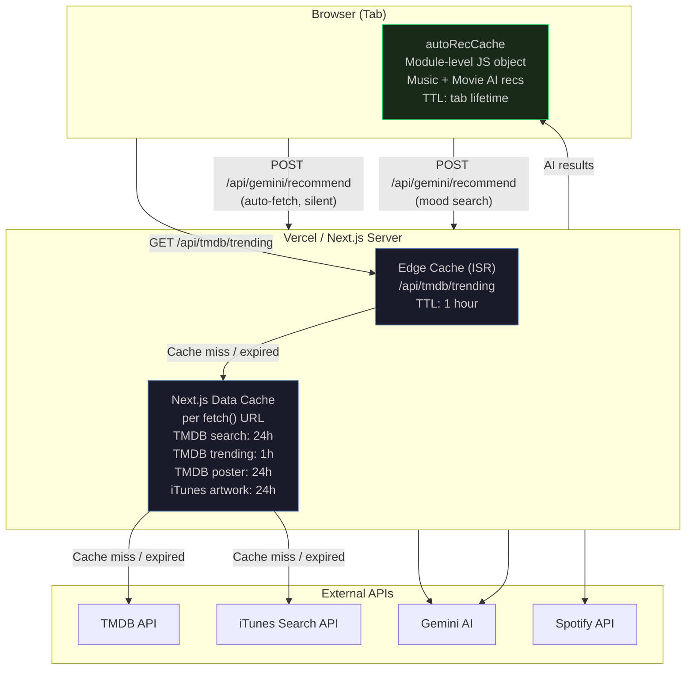
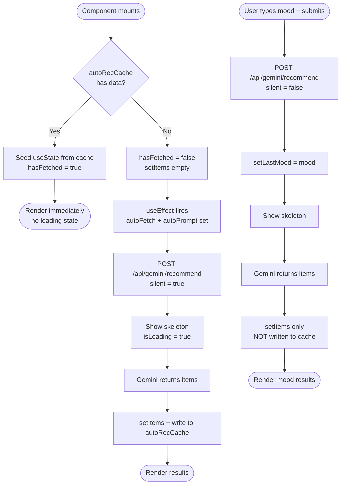
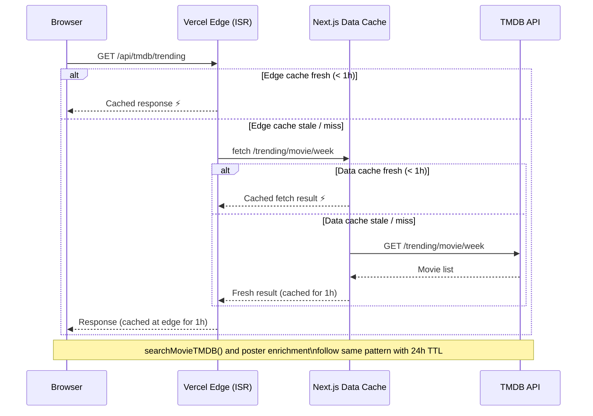
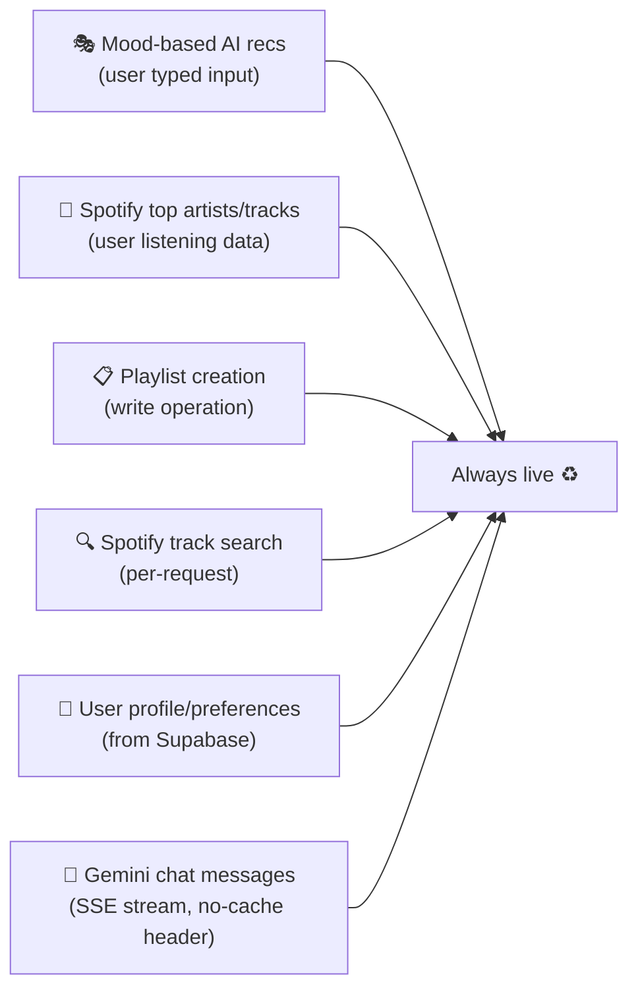

# RecMe — Caching Architecture Diagrams

## 1. Full Caching Layer Overview

---

## 2. Client-Side autoRecCache Flow

---

## 3. Server-Side TMDB Cache Flow

---

## 4. Cache TTL Summary

```mermaid
gantt
    title Cache TTL Comparison
    dateFormat  HH:mm
    axisFormat  %H:%M

    section Edge Cache
    TMDB Trending (ISR)       :active, 00:00, 1h

    section Next.js Data Cache
    TMDB Trending fetch       :active, 00:00, 1h
    TMDB Movie Search         :crit, 00:00, 24h
    TMDB Poster Detail        :crit, 00:00, 24h
    iTunes Album Art          :crit, 00:00, 24h

    section Client Memory
    autoRecCache (tab life)   :done, 00:00, 24h
```

---

## 5. What is Never Cached

