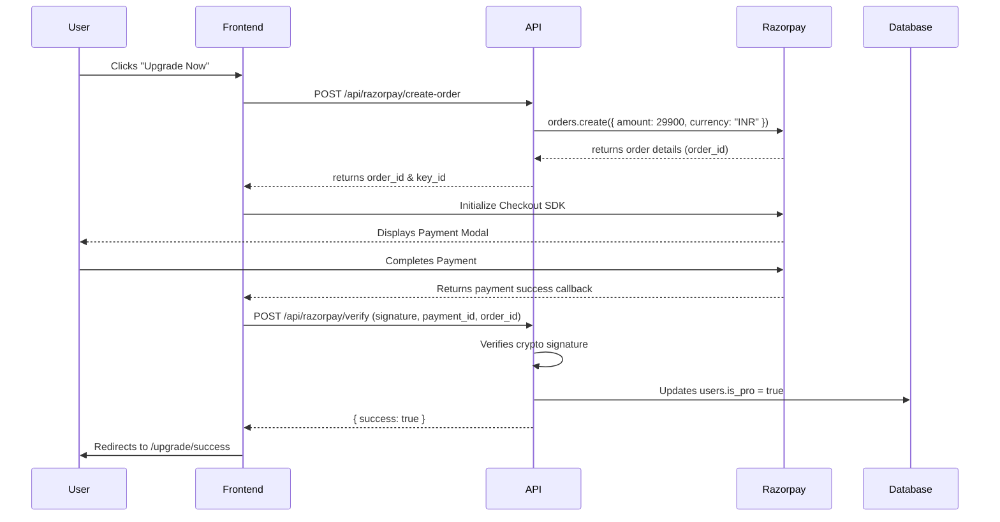

# RecMe Razorpay Payment Flow

```mermaid
sequenceDiagram
    participant User
    participant Frontend
    participant API
    participant Razorpay

    User->>Frontend: Clicks "Upgrade Now"
    Frontend->>API: POST /api/razorpay/create-order
    API->>Razorpay: orders.create({ amount: 29900, currency: "INR" })
    Razorpay-->>API: returns order details (order_id)
    API-->>Frontend: returns order_id & key_id

    Frontend->>Razorpay: Initialize Checkout SDK
    Razorpay-->>User: Displays Payment Modal
    User->>Razorpay: Completes Payment

    Razorpay-->>Frontend: Returns payment success callback
    Frontend->>API: POST /api/razorpay/verify (signature, payment_id, order_id)
    API->>API: Verifies crypto signature
    API->>Database: Updates users.is_pro = true
    API-->>Frontend: { success: true }
    
    Frontend->>User: Redirects to /upgrade/success
```
